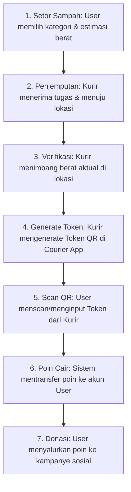

# 🌿 Eco-Donation Assistant

**Platform mobile berbasis React Native yang mengintegrasikan manajemen sampah daur ulang dengan sistem donasi sosial.**

Eco-Donation Assistant memfasilitasi pengguna untuk menyetorkan sampah daur ulang yang dikonversi menjadi **Poin Donasi**, kemudian disalurkan ke kampanye sosial, panti asuhan, dan inisiatif kemanusiaan lainnya. Sistem ini dirancang dengan mekanisme verifikasi on-site untuk memastikan transparansi dan mencegah fraud.


---

## 📋 Deskripsi & Workflow Sistem

Sistem ini dirancang untuk menghubungkan masyarakat yang peduli lingkungan (User) dengan mitra pengumpul sampah (Courier). Alur kerja utama dari aplikasi ini adalah sebagai berikut:



### Komponen Sistem
Eco-Donation Assistant terdiri dari **3 komponen** yang saling terintegrasi:

| Komponen | Teknologi | Deskripsi |
|----------|-----------|-----------|
| `user-app` | Expo (React Native) | Aplikasi pengguna untuk setor sampah, melihat leaderboard, dan donasi |
| `courier-app` | Expo (React Native) | Aplikasi kurir untuk penjemputan tugas dan verifikasi berat sampah |
| `backend-api` | Express + SQLite | REST API lokal sebagai pusat data, transaksi, dan logika bisnis |

---

## ✨ Sorotan Fitur Unggulan (Highlights)

Berikut adalah beberapa fitur utama yang menjadi pilar dalam aplikasi Eco-Donation Assistant:

### 1. 🗺️ Fitur Maps & Geocoding
Sistem peta interaktif dan penentuan lokasi (geocoding) yang sangat akurat menggunakan teknologi *open-source* bebas biaya tanpa API key berbayar.
- **Mobile (Native)**: Menggunakan **MapLibre Native** dengan *tile server* **OpenFreeMap** untuk visualisasi peta vektor yang sangat responsif. Pengguna dapat menggeser peta (*draggable map*) untuk presisi titik penjemputan.
- **Web**: Fallback otomatis menggunakan **OpenStreetMap Embed** iframe.
- **Pencarian Lokasi**: Terintegrasi dengan **Photon API** untuk *autocomplete* pencarian alamat (minimal 3 karakter) dan *reverse geocoding* (mendapatkan nama alamat dari koordinat) secara *real-time*.

### 2. 🏆 Fitur Pencapaian (Achievements & Badges)
Sistem gamifikasi yang dirancang untuk meningkatkan retensi dan motivasi pengguna.
Pengguna dapat mengumpulkan berbagai lencana (*badges*) dengan menyelesaikan target tertentu, seperti menyetorkan total 50 Kg sampah atau melakukan 10 kali donasi. Aplikasi menyediakan antarmuka *Modal* interaktif untuk memantau syarat, detail, dan persentase progres menuju penyelesaian lencana tersebut.

### 3. 🔐 Fitur QR Code & Token Verifikasi (Sistem Anti-Fraud)
Sistem keamanan *on-site* untuk mencegah kecurangan estimasi berat atau klaim fiktif.
- Setelah kurir sampai di lokasi dan menimbang sampah secara fisik, kurir menginput berat aktual tersebut ke dalam Courier App.
- Sistem akan merespons dengan **Token/QR Code Verifikasi** yang memiliki masa kedaluwarsa 30 menit.
- Pengguna (User) diwajibkan untuk memindai (*scan*) QR Code tersebut menggunakan perangkat mereka sebagai "tanda tangan digital" persetujuan. Poin hanya akan masuk setelah validasi token ini berhasil.

### 4. 🥇 Fitur Rank List (Leaderboard / Papan Peringkat)
Fitur *Leaderboard* yang menampilkan peringkat seluruh pengguna berdasarkan jumlah poin daur ulang yang berhasil dikumpulkan. Ini menambahkan elemen kompetitif yang sehat, memacu pengguna untuk konsisten menjaga lingkungan sekaligus berlomba-lomba mengumpulkan poin tertinggi.

### 5. 📡 Koneksi API (Lokal & Online Terintegrasi)
Sistem menggunakan arsitektur hybrid dalam pengelolaan dan penyediaan datanya:
- **Koneksi API Lokal (`backend-api`)**: Backend internal berbasis Express.js dan SQLite yang menangani seluruh alur operasional utama. API ini mengelola data autentikasi (login/register), manajemen *pickup* (penjemputan sampah), pembuatan Token QR, penghitungan kalkulasi poin, *leaderboard*, serta manajemen kampanye donasi panti asuhan lokal.
- **Koneksi API Online (`every.org`)**: Aplikasi User tidak hanya terbatas pada kampanye lokal. Melalui _service_ `globalGivingService.ts`, aplikasi mengkonsumsi REST API publik secara online (seperti **Every.org**). Koneksi online ini memperluas opsi donasi sehingga pengguna bisa menyalurkan poin mereka ke berbagai Non-Governmental Organization (NGO) internasional dan kampanye kemanusiaan berskala global secara dinamis.

---

## 💰 Sistem Poin

| Kategori Sampah | Rate per Kg |
|-----------------|-------------|
| Botol Plastik | 800 poin |
| Kertas | 600 poin |
| Kaleng | 1.000 poin |
| Botol Kaca | 500 poin |

**Konversi:** 1 Poin = Rp 1  
**Impact:** 1 Kg sampah ≈ 1.5 Kg pengurangan emisi CO₂

---

## 🚀 Instalasi & Menjalankan

### Prasyarat
- Node.js ≥ 18
- npm
- Expo Go (di smartphone) atau browser untuk web

### 1. Clone Repository
```bash
git clone <repository-url>
cd eco-donation-assistant
```

### 2. Backend API
```bash
cd backend-api
npm install
npm run seed    # Inisialisasi database dengan data demo
npm start       # Server berjalan di http://localhost:3000
```

### 3. User App
```bash
cd user-app
npm install
npx expo start
```
Scan QR code dengan Expo Go (smartphone) atau tekan `w` untuk web.

### 4. Courier App
```bash
cd courier-app
npm install
npx expo start --port 8082
```
Tekan `w` untuk membuka di browser (recommended untuk testing).

---

## ⚙️ Konfigurasi Jaringan (Penting!)

Jika menjalankan User/Courier App di **smartphone fisik** via Expo Go, pastikan:

1. Smartphone dan laptop terhubung ke **jaringan WiFi yang sama**.
2. Edit `user-app/src/services/api.ts` dan `courier-app/src/services/api.ts` (jika ada) — ganti IP dengan IP laptop (bukan `localhost`):

```typescript
const BASE_URL = Platform.OS === 'web'
  ? 'http://localhost:3000/api'
  : 'http://<IP_LAPTOP>:3000/api';  // contoh: http://192.168.1.5:3000/api
```

*(Cek IP laptop: jalankan `ipconfig` di CMD Windows atau `ifconfig` di Mac/Linux).*

---

## 🔐 Akun Demo

| Role | Email | Password |
|------|-------|----------|
| User | `satrio@email.com` | `123456` |
| User | `budi@email.com` | `123456` |
| Courier | `andi@kurir.com` | `123456` |
| Courier | `bima@kurir.com` | `123456` |

---

## 🛠️ Tech Stack Keseluruhan

| Layer | Teknologi |
|-------|-----------|
| **Mobile Framework** | Expo SDK 54 / React Native 0.81 |
| **Routing** | expo-router (file-based routing) |
| **State Management** | Zustand + persist (AsyncStorage) |
| **Maps & Tiles** | MapLibre Native + OpenFreeMap |
| **Geocoding API** | Photon API (by Komoot) |
| **Backend API** | Express 5.x |
| **Database** | SQLite3 |
| **Real-time Engine** | Socket.io 4.x |
| **External API** | Every.org API (untuk Kampanye Global) |

---

## 📝 Changelog

### v1.4.0 (Update Terbaru)
- 📝 **Dokumentasi Ulang (README Revamp)**: Pembaruan struktur README agar lebih terfokus pada alur kerja (*workflow*) sistem dan penonjolan fitur-fitur unggulan aplikasi.
- ✨ **Highlight Fitur & API**: Penambahan penjelasan mendetail untuk fitur *Maps, Achievements, QR Code Verifikasi (Anti-Fraud), Leaderboard*, dan penjabaran integrasi koneksi API (API Lokal dengan Express.js vs API Online dengan Every.org).

### v1.3.1
- 🌐 **Web Platform Support untuk Maps**: Implementasi OpenStreetMap iframe embed untuk *fallback* visualisasi peta di *web browser*. Memperbaiki *error* modul *native* saat dijalankan di web.
- 🐛 **Bug Fixes**: Perbaikan kondisi *Photon API 400 Bad Request* dengan penerapan *fallback* koordinat.

### v1.3.0
- 🗺️ **Major: Implementasi Maps Module**: Migrasi dari `react-native-maps` ke **MapLibre Native**. Integrasi OpenFreeMap dan fitur *search autocomplete* dengan Photon Geocoding API. Penambahan *draggable map marker* untuk kemudahan *pinpoint* lokasi penjemputan.

### v1.2.0
- ✨ **Sistem Notifikasi**: Implementasi sistem notifikasi *real-time* berbasis **Socket.io**.
- 🏆 **Pencapaian Interaktif**: Penambahan *modal* interaktif untuk detail lencana (badges) dan progres pencapaian.
- ⚙️ **Profil & Pengaturan**: Aktivasi modul Pengaturan Akun dan Pusat Bantuan (FAQ).

### v1.1.0
- 🚀 **Sistem Anti-Fraud**: Implementasi sistem keamanan penyetoran dengan Token/QR Code Verifikasi *on-site*.
- 📊 **Impact Portfolio**: Penambahan distribusi kategori sampah, *Leaderboard*, dan kalkulasi reduksi jejak karbon.

### v1.0.0
- 🎉 Rilis awal sistem Eco-Donation Assistant (pemisahan `user-app` dan `courier-app` dengan *backend* SQLite lokal).

---

## 👥 Tim Pengembang & Lisensi
Proyek ini dikembangkan sebagai tugas mata kuliah **Pemrograman Mobile** Semester 6.  
Dibuat secara komprehensif untuk keperluan pembelajaran dan eksplorasi teknologi *mobile application*.
