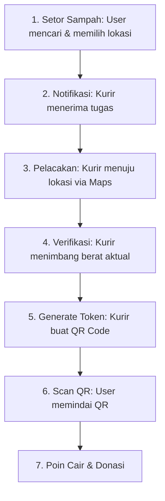

# 🌿 Eco-Donation Assistant

**Platform mobile berbasis React Native yang mengintegrasikan manajemen sampah daur ulang dengan sistem donasi sosial.**

Eco-Donation Assistant memfasilitasi pengguna untuk menyetorkan sampah daur ulang yang dikonversi menjadi **Poin Donasi**, kemudian disalurkan ke kampanye sosial, panti asuhan, dan inisiatif kemanusiaan lainnya. Sistem ini dirancang dengan mekanisme verifikasi on-site untuk memastikan transparansi dan mencegah fraud.


> **Dokumentasi Konsolidasi**: README ini telah diperbarui untuk menggabungkan seluruh dokumentasi teknis (termasuk fitur peta, notifikasi *real-time*, koordinat *anti-fraud*, serta panduan instalasi sub-aplikasi) menjadi satu referensi utama yang bersih dan terstruktur.

---

## 📋 Deskripsi & Alur Kerja (Workflow) Sistem

Sistem ini dirancang untuk menghubungkan masyarakat yang peduli lingkungan (User) dengan mitra pengumpul sampah (Kurir). Alur kerja utama dari aplikasi ini adalah sebagai berikut:



### Komponen Sistem
Eco-Donation Assistant terdiri dari **3 komponen** yang saling terintegrasi:

| Komponen | Teknologi | Deskripsi |
|----------|-----------|-----------|
| `user-app` | Expo (React Native) | Aplikasi pengguna untuk setor sampah, melihat leaderboard, notifikasi *real-time*, dan donasi. |
| `courier-app` | Expo (React Native) | Aplikasi kurir untuk penerimaan order, navigasi lokasi cerdas, dan verifikasi berat sampah. |
| `backend-api` | Express + SQLite | REST API lokal sebagai pusat data transaksi, *WebSocket server*, serta validasi koordinat yang ketat. |

---

## ✨ Sorotan Fitur & Implementasi Teknis

### 1. 🗺️ Fitur Peta, Geocoding, & Navigasi Kurir
Sistem navigasi dirancang dengan arsitektur berakurasi tinggi:
- **Pencarian Autocomplete & Penentuan Lokasi (User App)**: Menggunakan **MapLibre Native** dengan *tile server* dari **OpenFreeMap** dan **Photon API** untuk *geocoding*. Pengguna dapat mengetikkan sebagian nama tempat (mis: "UI Depok") untuk mendapatkan saran alamat (*autocomplete*) secara instan dengan teknik *debounce* 300ms.
- **Peta Interaktif (Draggable)**: Pengguna dapat menggeser peta (*draggable*) untuk mengatur posisi pin dengan sangat akurat. Lokasi ini kemudian di-*reverse geocode* untuk mendapatkan nama jalan otomatis.
- **Validasi Koordinat Ketat (Backend)**: Backend memvalidasi koordinat lokasi (latitude: -90 s/d 90, longitude: -180 s/d 180) serta mendeteksi *swapped coordinates* (titik lintang dan bujur terbalik) untuk mencegah misnavigasi. Peringatan akan muncul jika alamat berada di luar wilayah Indonesia.
- **Deep-Linking Navigasi Kurir (Courier App)**: Melalui tombol cerdas "Buka di Google Maps", kurir akan langsung diarahkan menuju rute penjemputan di **Google Maps** (Android) atau **Apple Maps** (iOS). Jika native app tidak terdeteksi, navigasi diarahkan sebagai *fallback* ke browser web secara mulus.

### 2. 🔔 Sistem Notifikasi Real-Time (Socket.io)
Dilengkapi dengan sistem notifikasi dua arah (*real-time*) berbasis *WebSocket* (tanpa Firebase):
- **Live Update Pesanan**: Pengguna langsung menerima notifikasi ketika permintaan pesanan diterima kurir tanpa perlu me-*refresh* aplikasi.
- **Estimasi Jarak (ETA)**: Sistem membaca *update* lokasi kurir setiap 30 detik secara latar belakang dan memberi notifikasi progres penjemputan otomatis (contoh: "Kurir tiba dalam ~5 menit" untuk jarak < 500m).
- **Panduan UI Otomatis**: Saat kurir selesai menimbang sampah, aplikasi akan memunculkan *prompt* khusus **"Pindai QR Sekarang"** di riwayat pengguna.

### 3. 🔐 Sistem Keamanan & Verifikasi (Anti-Fraud)
Untuk mencegah laporan fiktif pencairan poin sampah:
- Penimbangan wajib dilakukan langsung di lokasi (*on-site*).
- Courier App menghasilkan **Token/QR Code 6-digit** yang berlaku maksimal selama 30 menit.
- User App diwajibkan untuk memindai Token tersebut sebagai persetujuan (digital signature) sebelum poin donasi dicairkan.

### 4. 🎨 Desain Antarmuka Modern & Dinamis
- **Dashboard Statistik**: Menggunakan *card* elegan dengan *shadow* dan latar gradien.
- **Status Warna Dinamis**: Status ditandai dengan gradasi warna yang mudah dipahami: Menunggu (Merah/Alert), Verifikasi (Kuning), On The Way (Biru).
- **Feedback Interaktif**: Semua elemen klik memiliki animasi reaksi (*active opacity*) untuk *User Experience* yang responsif.

### 5. 🏆 Gamifikasi & Integrasi API Eksternal
- Sistem pencapaian berupa lencana (*Badges*) interaktif dengan _progress bar_ (contoh: Donatur Aktif).
- Selain API Backend (SQLite Lokal), aplikasi terintegrasi dengan **Every.org API** yang memungkinkan pengguna berdonasi kepada organisasi NGO internasional, tidak sebatas panti asuhan lokal.

---

## 💰 Sistem Poin & Dampak Lingkungan

| Kategori Sampah | Nilai per Kg |
|-----------------|--------------|
| Botol Plastik | 800 poin |
| Kertas | 600 poin |
| Kaleng | 1.000 poin |
| Botol Kaca | 500 poin |

**Konversi:** 1 Poin = Rp 1  
**Dampak Lingkungan:** Setiap 1 Kg sampah ≈ 1.5 Kg pengurangan emisi gas rumah kaca (CO₂).

---

## 🚀 Instalasi & Menjalankan Aplikasi

### Prasyarat
- Node.js ≥ 18
- npm
- Aplikasi **Expo Go** terinstal di smartphone penguji

### 1. Menyiapkan Backend API & Database
```bash
git clone https://github.com/Rizalibrah08/Eco-Donation-V2.git
cd Eco-Donation-V2/backend-api

npm install
npm run seed    # Melakukan inisialisasi basis data (dummy data)
npm start       # Menjalankan server Express di http://localhost:3000
```
> *(Skrip internal seperti `npm run migrate` atau `node check-all-coordinates.js` dapat digunakan sewaktu-waktu untuk audit struktur database lokasi).*

### 2. Menjalankan User App
Buka jendela terminal (tab) baru:
```bash
cd user-app
npm install
npx expo start
```
*Gunakan Expo Go di smartphone Anda untuk memindai kode QR.*

### 3. Menjalankan Courier App
Buka terminal baru:
```bash
cd courier-app
npm install
npx expo start --port 8082
```
*Gunakan Expo Go di smartphone Anda untuk memindai kode QR.*

---

## ⚙️ Konfigurasi Jaringan (Penting!)

Jika aplikasi diuji langsung melalui ponsel, **pastikan laptop server dan ponsel berada pada 1 jaringan WiFi yang sama**. 
Update IP alamat backend di file layanan aplikasi (`user-app/src/services/api.ts` dan `courier-app/src/services/api.ts`):
```typescript
const BASE_URL = Platform.OS === 'web'
  ? 'http://localhost:3000/api'
  : 'http://192.168.1.X:3000/api'; // Ganti '192.168.1.X' dengan IPv4 komputer Anda
```

### Akun Demo Uji Coba

| Peran | Email | Kata Sandi |
|------|-------|----------|
| User | `satrio@email.com` | `123456` |
| User | `budi@email.com` | `123456` |
| Kurir| `andi@kurir.com` | `123456` |
| Kurir| `bima@kurir.com` | `123456` |

---

## 👥 Tentang Proyek & Lisensi
Proyek **Eco-Donation Assistant** ini dikembangkan sebagai tugas akhir dan eksplorasi terpadu pada mata kuliah **Pemrograman Mobile** Semester 6.  
Mengedepankan *clean architecture*, penggunaan teknologi mandiri bebas biaya (*open-source MapLibre & Photon API*), serta interaktivitas *real-time WebSocket*.
